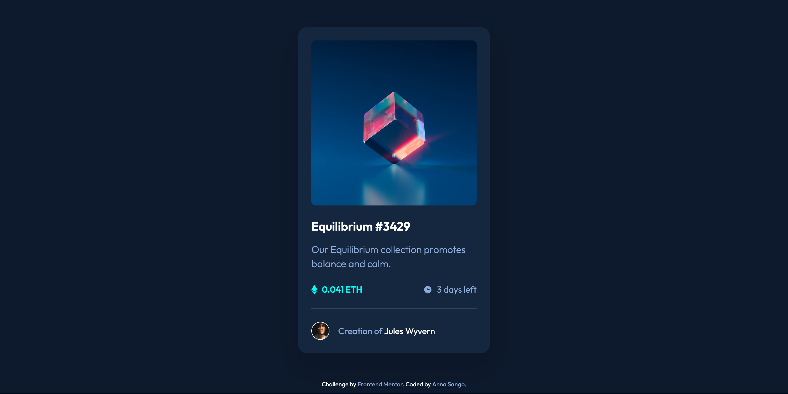

# Frontend Mentor - NFT preview card component solution

This is a solution to the [NFT preview card component challenge on Frontend Mentor](https://www.frontendmentor.io/challenges/nft-preview-card-component-SbdUL_w0U). Frontend Mentor challenges help you improve your coding skills by building realistic projects.

## Table of contents

- [Overview](#overview)
  - [The challenge](#the-challenge)
  - [Screenshot](#screenshot)
  - [Links](#links)
- [My process](#my-process)
  - [Built with](#built-with)
  - [What I learned](#what-i-learned)
  - [Continued development](#continued-development)
- [Author](#author)

## Overview

### The challenge

This Frontend Mentor challenge was to build out an NFT preview card component. A detailed Figma file was provided and I tried to build out the component to ensure that it looked as close to the design as possible.

Users should be able to:

- View the optimal layout depending on their device's screen size
- See hover states for interactive elements

### Screenshot



### Links

- Solution URL: [Add solution URL here](https://your-solution-url.com)
- Live Site URL: [Add live site URL here](https://fem-nft-preview-card-nine.vercel.app/)

## My process

### Built with

- Semantic HTML5 markup
- CSS
- Flexbox

### What I learned

This challenge was a good opportunity to test my layout skills, as well as some of the things I've learnt about writing cleaner (DRY) CSS markup. It seemed like a simple challenge, but I was reminded that even simple layouts aren't as easy to build out as they may initially seem to be. The most challenging aspect of this design was working on the active/hover state for the main image. I tried to get it as close to the design as possible, but the result that I have has a slight colour difference. I spent some time researching how to achieve the desired effect, but I do feel like my CSS markup for the image active/hover state is a bit... hacky. And I wonder if there is a better way to do this to get it closer to the design.

This is the CSS for the image active/hover state:

```css
.card-img:hover,
.card-img:active {
  background-color: rgba(0, 255, 248, 0.5);
  background-image: url("images/icon-view.svg"),
    url("images/image-equilibrium.jpg");
  background-size: 18%, 100%;
  background-position: center;
  background-repeat: no-repeat;
  background-blend-mode: screen;
}
```

### Continued development

In this challenge, I primarily used rem units because I'm not quite comfortable with em units yet. In future challenges I'd like to begin incorporating ems for margins and padding instead of using rems. I think I have also developed a bit of an over-reliance on using flexbox for minor layout details and I'd like to just check whether this is actually considered a best practice or not. I'm not sure whether positioning is actually a better option, but I'll look into this.

## Author

- Frontend Mentor - [@yourusername](https://www.frontendmentor.io/profile/yourusername)
- Instagram - [@yourusername](https://www.twitter.com/yourusername)
